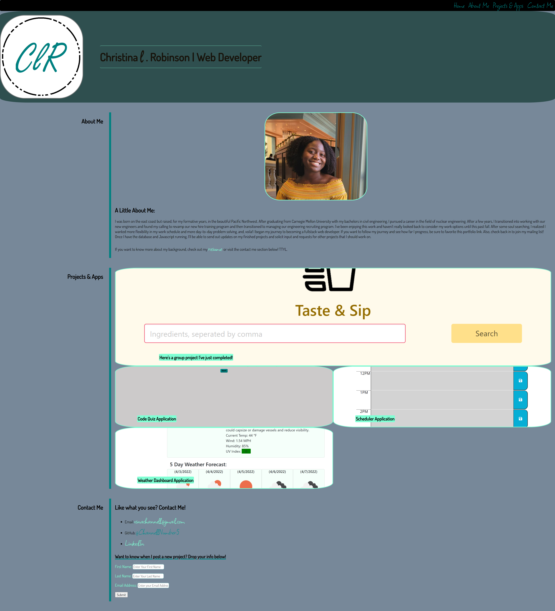

# Christina Robinson's Portfolio Page

This is an evolving webpage/application dedicated to displaying the projects of Christina Robinson for future employers and other parties interested in viewing her work. This portfolio page will be constantly updated, as Christina increases her skills in fullstack web development. The design and user experience of this webpage is limited currently to Christina's current experience level, but as her knowledge base grows, this portfolio page will increase in it's design and capability.

Click [here](https://channellnumber5.github.io/CRobinsonPortfolio/) to see the deployed portfolio.

And here is the screenshot of what it looks like:

## Learning Lessons

As of 3/2/2022, this portfolio page is focused on show casing responsive webpage design in how the project screenshots are laid out on a standard computer screen and then how that layout changes as the screen size decreases. For this challenge, the webpage style sheet employs the use of flex box. That, in and of itself, was a huge challenge in creating this webpage.

Another challenge, was (and continues to be) using relative, fixed and abolute positioning to display items and pieces of text like a navigation bar that scrolls with the page or fixing caption labels to project screenshots. 

Finally, the current state of this webpage is using limited intances of psuedo elements to change the colors of links when they are interacted with and that was and continues to be a big learning curve.

## License

This project is licensed under the MIT license.

[MIT License](https://opensource.org/licenses/MIT)

## Credits/Contact Info

Christina Robinson

Email: [CLRCoding@gmail.com](mailto:CLRCoding@gmail.com)

Github: [ChannellNumber5](https://github.com/ChannellNumber5)

## Resources

In addition to the coding bootcamp curriculum, here were a few webpages that were helpful in creating this portfolio:

- [CSS Layout - Aligning Items](https://www.w3schools.com/css/css_align.asp)

- [Psuedo Classes](https://developer.mozilla.org/en-US/docs/Web/CSS/:visited)

- [Box-Sizing](https://developer.mozilla.org/en-US/docs/Web/CSS/box-sizing)

- [StackOverflow on Headers](https://stackoverflow.com/questions/41576098/header-and-footer-doesnt-reach-the-edges-of-webpage)

- [Flexbox Zombies Game](https://mastery.games/flexboxzombies)

- [Scaling and Cropping Images](https://www.digitalocean.com/community/tutorials/css-cropping-images-object-fit)

- [Complete Guide to Flexbox](https://css-tricks.com/snippets/css/a-guide-to-flexbox/)

- [Bulma Navbar Framework](https://bulma.io/documentation/components/navbar/)

- [Media Query](https://www.w3schools.com/cssref/css3_pr_mediaquery.asp)

-[Body to take up 100% of view port](https://www.freecodecamp.org/news/html-page-width-height/)